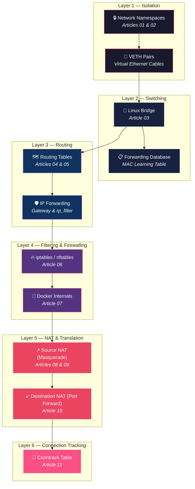
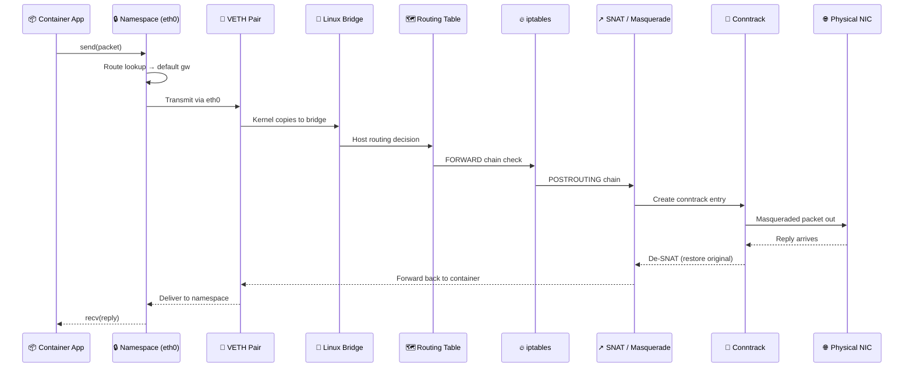

<div align="center">

# 🔬 Container Networking From Scratch

### Master How Linux Actually Moves Packets — No Docker, No Kubernetes, Just Raw Kernel Primitives

[](https://kernel.org)
[](https://docs.docker.com)
[](https://kubernetes.io)
[](LICENSE)

---

*An 11-part hands-on deep dive into the Linux networking primitives that power every container in production.*

**Stop guessing when production networking fails. Start understanding how the kernel actually works.**

</div>

---

## 🧐 What Is This?

Most DevOps engineers use containers daily without truly understanding how a packet leaves a container and reaches the physical network. When networking fails in production, they restart services and hope for the best.

**This series changes that.**

Each article removes Docker and Kubernetes from the picture and builds networking concepts directly using Linux primitives — `ip netns`, `veth pairs`, `bridges`, `iptables`, `routing tables`, and `conntrack`. You type the commands, break things on purpose, fix them, and develop a mental model of how the kernel actually moves packets.

By the end of this series, you'll be able to:

- 🏗️ **Build** an entire container network from scratch using only Linux commands
- 🔍 **Debug** production networking issues at the kernel level
- 🧠 **Understand** exactly what Docker and Kubernetes do behind the scenes
- ⚡ **Diagnose** NAT failures, routing black holes, and conntrack table exhaustion

---

## 🏛️ Architecture Overview

The series progressively builds up the full container networking stack, layer by layer:



### How a Packet Travels From Container to Internet



---

## 📚 Article Index

| # | Article | Key Concepts | What You Build |
|---|---------|-------------|----------------|
| **01** | [Linux Network Isolation: Beyond the Docker Abstraction](01%20-%20Linux%20Network%20Isolation_%20Beyond%20the%20Docker%20Abstraction.md) | Network Namespaces, VETH Pairs, `ifindex` | Isolated namespace connected to host via virtual cable |
| **02** | [Why Your Containers Can't Talk: Mastering Linux IP and ARP Resolution](02%20-%20Why%20Your%20Containers%20Can't%20Talk_%20Mastering%20Linux%20IP%20and%20ARP%20Resolution.md) | ARP Resolution, Neighbor Cache, MAC addresses | Two namespaces communicating with ARP tracing |
| **03** | [Linux Bridge & Forwarding Database: The Invisible Switch in Your Kernel](03%20-%20Linux%20Bridge%20%26%20Forwarding%20Database_%20The%20Invisible%20Switch%20in%20Your%20Kernel.md) | Linux Bridge, FDB, MAC Learning, STP | Multi-container bridge network (like `docker0`) |
| **04** | [Linux Routing Internals: Why Your Multi-Subnet Traffic is Dropping](04%20-%20Linux%20Routing%20Internals_%20Why%20Your%20Multi-Subnet%20Traffic%20is%20Dropping.md) | Routing Tables, IP Forwarding, `rp_filter` | Multi-subnet routed network with cross-subnet traffic |
| **05** | [Linux Routing Deep Dive: Gateway Secrets and External Connectivity](05%20-%20Linux%20Routing%20Deep%20Dive_%20Gateway%20Secrets%20and%20External%20Connectivity.md) | Default Gateway, NAT Masquerade, Asymmetric Routing | Namespace with full internet access |
| **06** | [Why Your Containers Can't Talk: iptables, Docker, and the Linux Bridge](06%20-%20Why%20Your%20Containers%20Can't%20Talk_%20The%20Hidden%20War%20Between%20iptables%2C%20Docker%2C%20and%20the%20Linux%20Bridge.md) | iptables chains, `br_netfilter`, `DOCKER-ISOLATION` | Firewall rules controlling bridge traffic |
| **07** | [Docker Networking Demystified (Under the Hood)](07%20-%20Docker%20Networking%20Demystified%20(Under%20the%20Hood).md) | Docker bridge internals, `docker0`, Container DNS | Reverse-engineered Docker network |
| **08** | [Why Your Private Cloud Can't Reach the Internet](08%20-%20Why%20Your%20Private%20Cloud%20Can't%20Reach%20the%20Internet.md) | NAT fundamentals, Masquerade vs SNAT, Routing gaps | Private cloud network with internet access |
| **09** | [Source NAT Secrets: Why Your Containers Can't Talk to the Internet](09%20-%20Source%20NAT%20Secrets_%20Why%20Your%20Containers%20Can't%20Talk%20to%20the%20Internet.md) | SNAT deep dive, `POSTROUTING`, Port mapping | Full SNAT pipeline with packet tracing |
| **10** | [Why Your Port Forwarding Fails: The Hidden Logic of Destination NAT](10%20-%20Why%20Your%20Port%20Forwarding%20Fails_%20The%20Hidden%20Logic%20of%20Destination%20NAT.md) | DNAT, `PREROUTING`, Port forwarding | Working port-forwarded service (like `docker -p`) |
| **11** | [Why Your Kubernetes Services Are Latent: The Conntrack Table Ghost](11%20-%20Why%20Your%20Kubernetes%20Services%20Are%20Latent_%20The%20Conntrack%20Table%20Ghost.md) | Conntrack table, Connection tracking, Table exhaustion | Conntrack monitoring and tuning setup |

---

## 🗺️ Learning Path


> **📌 Read in order.** Each article builds directly on concepts and lab environments from the previous one. Skipping ahead will leave gaps in your understanding.

---

## 🛠️ Prerequisites

| Requirement | Details |
|------------|---------|
| **OS** | Ubuntu 22.04 / 24.04 (or any modern Linux distro) |
| **Access** | Root / sudo privileges |
| **Tools** | `iproute2`, `tcpdump`, `bridge-utils`, `iptables`, `conntrack` |
| **Knowledge** | Basic Linux command line, TCP/IP fundamentals |

### Quick Setup

```bash
sudo apt update
sudo apt install -y iproute2 tcpdump bridge-utils iptables conntrack
```

> **💡 Tip:** Use a VM or cloud instance — these labs modify network configuration and iptables rules that could disrupt your system.

---

## 🎯 Who Is This For?

- **DevOps / SRE Engineers** who troubleshoot container networking in production
- **Backend Developers** who want to understand what happens below `docker run`
- **Cloud Engineers** building or managing Kubernetes clusters
- **Students** preparing for CKA/CKAD/CKS certifications
- **Anyone** curious about how the Linux kernel actually handles network packets

---

## ✨ Suggested Repository Names

Looking for a catchier name? Here are some alternatives:

| Name | Vibe |
|------|------|
| **`linux-net-internals`** | Clean, professional, searchable |
| **`packet-journey`** | Storytelling — follows a packet's path through the kernel |
| **`under-the-wire`** | Catchy, implies deep investigation |
| **`netcraft`** | Short, memorable, "crafting networks" |
| **`bare-metal-networking`** | Emphasizes the raw, no-abstraction approach |
| **`kernel-net-lab`** | Highlights the hands-on lab aspect |
| **`container-net-deep-dive`** | Descriptive with the "deep dive" hook |
| **`the-packet-path`** | Evocative — every article traces where packets go |
| **`netns-mastery`** | Technical and specific to the core tool used |
| **`zero-to-packet`** | "Zero to hero" style, implies building from nothing |

---

## 🤝 Contributing

Found a typo, a missing step, or want to add a new article? Contributions are welcome!

1. Fork this repository
2. Create a branch (`git checkout -b fix/article-03-typo`)
3. Commit your changes
4. Open a Pull Request

---

## 📄 License

This project is open source and available under the [MIT License](LICENSE).

---

<div align="center">

**If this series helped you understand networking better, give it a ⭐**

*Built with frustration from debugging production networking at 3 AM* 🌙

</div>
